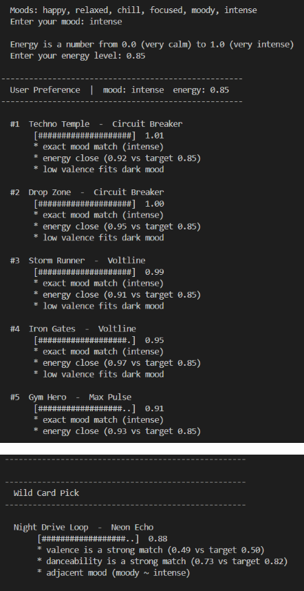
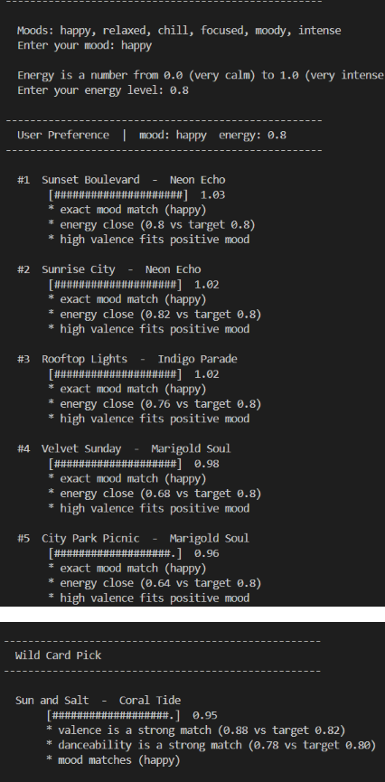
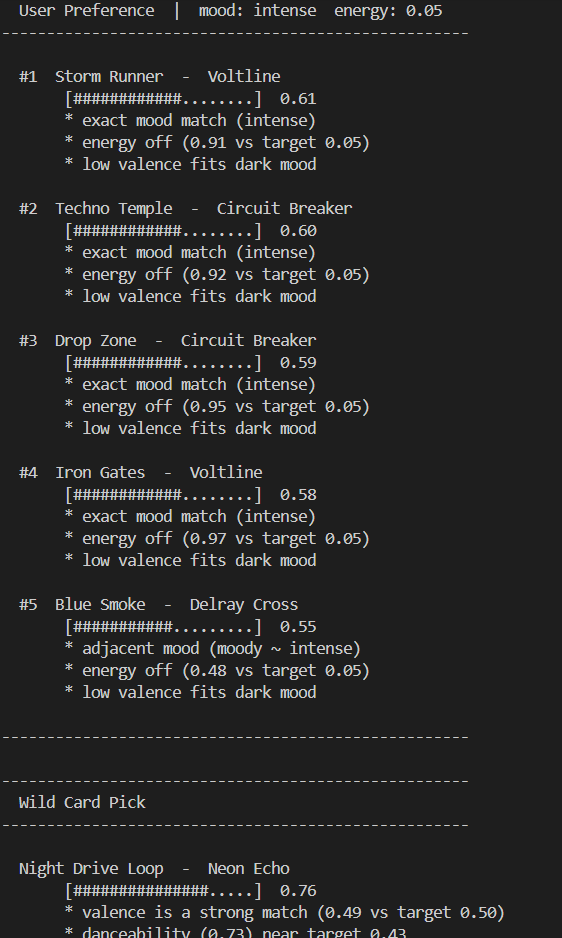
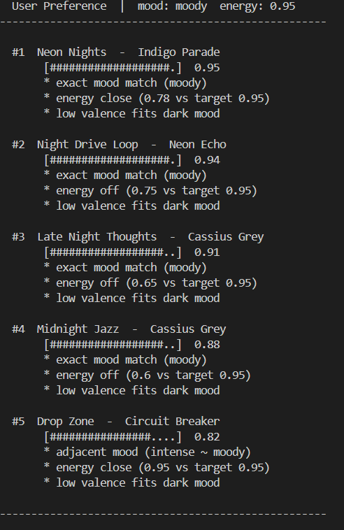
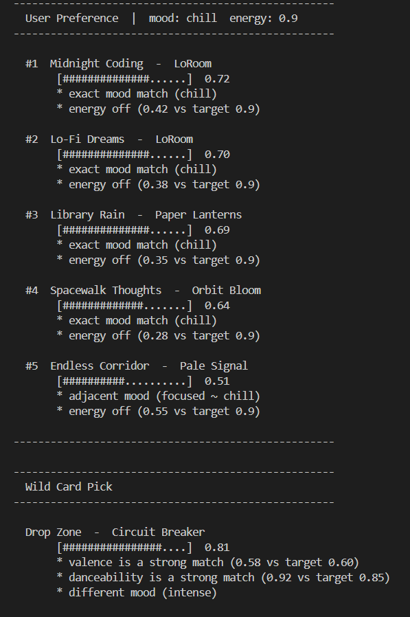

# 🎵 Music Recommender Simulation

## Project Summary

In this project you will build and explain a small music recommender system.

Your goal is to:

- Represent songs and a user "taste profile" as data
- Design a scoring rule that turns that data into recommendations
- Evaluate what your system gets right and wrong
- Reflect on how this mirrors real world AI recommenders

Replace this paragraph with your own summary of what your version does.

---

## How The System Works

Explain your design in plain language.

Some prompts to answer:

- What features does each `Song` use in your system
  - For example: genre, mood, energy, tempo
  - Each song stores `mood`, `energy`, `valence`, `danceability`, `genre`, `tempo_bpm`, and `acousticness` — but only mood, energy, valence, and danceability are actually used in scoring. Genre, tempo, and acousticness are loaded but ignored.

- What information does your `UserProfile` store
  - It stores four fields: `favorite_mood` (a label like "happy" or "intense"), `target_energy` (0.0–1.0), `target_valence`, and `target_acoustic`. In practice, only `favorite_mood` and `target_energy` are used by the main recommender.

- How does your `Recommender` compute a score for each song
  - It adds up four weighted signals: mood match (0.45 — exact, half-credit for adjacent, zero otherwise), energy proximity (0.40 — closer = higher), a flat +0.1 valence bonus for matching mood/valence pairs, and a small danceability boost (up to +0.1) only when target energy is above 0.7.

- How do you choose which songs to recommend
  - Every song in the catalog is scored, the list is sorted highest to lowest, and the top 5 are returned. There is no randomness — the same inputs always produce the same ranked list.

- write a short paragraph explaining your understanding of how real-world recommendations work and what your version will prioritize.
  - Music platforms like Spotify, YT Music, and Apple Music make song recommendations based on specified user tastes, songs they interact with, and popular songs. They may take into account most interacted genres or artists, and will recommend popular artists in a genre the user likes for diversity. Each platform weights these things differently to come up with the recommendations and what songs to play in the user's playlists. My recommender is based on what mood the user is looking for and their energy level. It doesn't use genre when picking songs

- Algorithm Recipe
  - For each song in the catalog, the system computes a score by heavily weighting mood match (45%) and energy closeness (40%), then adding small bonuses for valence and danceability when relevant. Songs with an exact mood match score highest, adjacent moods get partial credit, and mismatched moods score zero for that component. The five songs with the highest total scores are returned as recommendations. My algorithm does not account for genre so if a user wants a specific genre with a specfic mood, they cannot specify that and they will get recommendations from different genres. 
---

## Getting Started

### Setup

1. Create a virtual environment (optional but recommended):

   ```bash
   python -m venv .venv
   source .venv/bin/activate      # Mac or Linux
   .venv\Scripts\activate         # Windows

2. Install dependencies

```bash
pip install -r requirements.txt
```

3. Run the app:

```bash
python -m src.main
```

### Running Tests

Run the starter tests with:

```bash
pytest
```

You can add more tests in `tests/test_recommender.py`.

---

## Experiments You Tried

Use this section to document the experiments you ran. For example:

- What happened when you changed the weight on genre from 2.0 to 0.5
- What happened when you added tempo or valence to the score
- How did your system behave for different types of users
  - My 
---

## Limitations and Risks

Summarize some limitations of your recommender.

Examples:

- My recommender is built for users who want to build playlists based on vibes to it ignores genres. This may lead to some genres being overrepresented

---

## Reflection

Read and complete `model_card.md`:

[**Model Card**](model_card.md)

Write 1 to 2 paragraphs here about what you learned:

- Commercial recommenders balance making money and keeping users engaged which affects what data they gather and how they use it. All recommenders take data on previous engagement, current listening behaviors, and popularity into consideration but to different degrees. Popularity, for example, is broken down between popular songs among listeners like you and songs that are popular among the general public. The system may also take into account your behavior around these songs to determine which condition matters more to the user. 
- If a system relies to too much on comparing your user profile to another one similar to it, this could trap both users in a musical bubble if there is an over-representation of a specific type of listener. They would be stuck listening to the same songs. Also, if someone new with a completely different taste comes in, because the system is trained on similar data, an outlier would be recommended songs that are completely different from what they expect.

---

## 7. `model_card_template.md`

Combines reflection and model card framing from the Module 3 guidance. :contentReference[oaicite:2]{index=2}  

```markdown
# 🎧 Model Card - Music Recommender Simulation

## 1. Model Name: Tap To Resonate

---

## 2. Intended Use

- What is this system trying to do
- Who is it for

> This recommender is perfect for the vibe chaser. This model is for users that to create playlists to fit every mood without limits of genre or artists. Specify a mood and energy level and let the algorithm will suggest 5 songs with a Wild Card as suprise. 
---

---

## 3. How It Works (Short Explanation)

Describe your scoring logic in plain language.

- The features I used where dancibility, mood, energy, and valence. I added valence and dancibility as fields and 40 more songs to the dataset. I have the user specify target mood and energy, the main algorithm prioritizes those two field when picking songs with  Mood match counting the most. If a song's mood matches exactly, it gets full points; if it is close but not exact, it gets partial points; if it does not match at all, it gets zero for that part. Energy closeness is the second biggest factor with the closer a song's energy is to what the user specifies, the better it scores. The model also gives small bonus points if the emotional tone of a song (its valence) fits the mood, and if a song is very danceable when in a high-energy mood. All those points are added up, and the five songs with the highest scores are recommended to you. The wild card recommender picks songs that are closer to an assumed dancibility and valence based on the inputed mood and energy. This was added in case a user wants fresh unexpected song. It still takes into account what they originally inputted so that it would make sense but there is a little more freedom with using different fields. That way the suggestions give variety but still fit the overall vibe.

- Changes from starter logic: valence and danceability were added as scoring signals so the emotional tone and rhythm of a song factor into the score, not just mood and energy. Genre was removed from the user profile since this app is vibe-based, not genre-based. The song catalog was also expanded from 4 songs to 50 to give the recommender a more realistic pool to pull from.


---

## 4. Data

Describe your dataset.

- THere are a total of 50 songs in the dataset. There are 6 moods, happy, relaxed, intense, moody, chill, and focused so it is mood diverse. The genres are diverse but because the number of data points is small, most genres only have 1-2 songs representing it.

- Lofi is overrepresented with 4 songs meaning that a chill user will likely get a lofi list by default. 
- There is very little classical music
---

## 5. Strengths

Where does your recommender work well

- My system gives the best results for users who have a clear mood and energy in mind. For example, a user who enters "intense" with energy 0.9 will consistently get high-energy songs that match that feeling, because mood and energy together make up 85% of the score. Users in the middle of the mood spectrum — like "moody" or "happy" — also benefit from the adjacency system, which catches songs that are close but not exact matches. 

---

## 6. Limitations and Bias

Where does your recommender struggle

- The most obvious is that it does not consider genres at all. While this is intentionaly, it can lead to certain genres being unintentionally over suggested because it naturally leans towards a specific mood or energy. Lofi is also over-represented with 4 songs. With 50 datapoints this feels small but because there are so many genres, others do not have the same amount. This leads to a case where if a user wants a chill mood they are almost guaranteed a lofi playlist. Claude also pointed out that the catalog is American centered with very few genres from other parts of the world. The song catalog also skews towards younger listeners by excluding genres like classic rock and classical/orchestral music
---

## 7. Evaluation

How did you check your system
- I tested predictable user profiles like intense mood with high energy to check that the system worked as expected, returning songs that fit both
- I also tested different energies for the same mood to see if different songs would be suggested which suprisingly did not work as well. It ended up suggesting a lot of the same songs in similar rankings because the energy levels were still close eventhough not exact. This may be an issue with the dataset
- To stretch it, I created user profiles that seemed less intuitive like low energy and intense, which in some cases it behaved as expected (unable to recommend accurately) and sometimes not. Recommendations here were not as accurate since realistically low energy intense songs are not common, which is reflected in my dataset.
- I checked the reasons for each suggestion to check whether the weights I wrote in my algorithm produced results that made sense.

---

## 8. Future Work

If you had more time, how would you improve this recommender
- If I were to improve this model with more time, I would add the ability to save recommended songs or add a little randomness so that a user would not get the exact same songs when inputting the same data everytime the program is run. This would make it more reflective of a real recommendation algorithm
-  I would also expand the dataset so that there is more diversity in types of moods and energy within a single genre. It would be less likely to produce a situation where chill mood = lofi genre
---
---

## 9. Personal Reflection

A few sentences about what you learned:
- I learned that building a recommendation system takes a lot of planning. It requires thinking about what a user is expecting when they give their preferences. I did not expect it to require so much data to be accurate. I created 50 data points but that may not be enough to get a good working system. In a way it confirmed
- I use Spotify and one of things I love about the platform is its diverse playlists and ability to recommend diverse songs, however my biggest issue is that once it figures out what you like, it is hard to get recommendations outside of what it has assessed. Building my recommender helped shed light on how difficult it is to balance what users specify as their tastes and how a person actually interacts with music. 

## Photos

### Working as Intended



### Adversarial Tests

**Test Oxymoron: Intense, 0.05** — All intense songs have energy 0.91–0.97


**Test Inverse Gap: Moody, 0.95** — All moody songs cap at 0.78 but exact mood match outweighs energy accuracy


**Test Dead Zone: Chill, 0.90** — No high energy chill songs exist in the catalog

